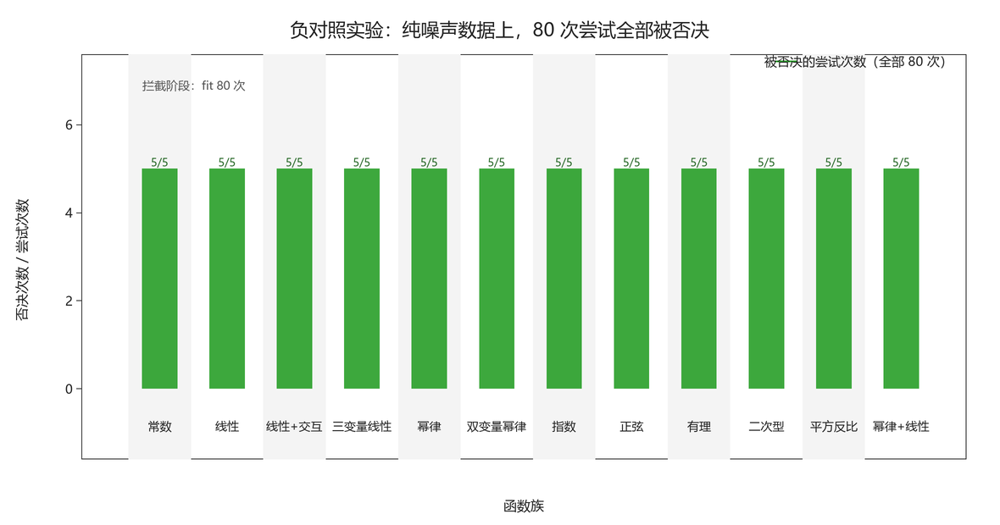

# 负对照实验设计与结果（M3 交付）

> 这是懂机器学习的人最容易低估、也最能拉开差距的一项：**纯噪声输入时，系统会不会为了交差编一个公式出来？**
>（对应《执行计划与分工》§5.2 第 5 条）

## 一、实验设计（判定标准事先写死，不许事后调整）

- **输入**：`y ~ Normal(0, 1)`，与全部三个自变量完全独立；自变量在 [1, 10] 上均匀采样。
- **正确答案**：未发现稳定公式。
- **判定**：每一次尝试都必须被否决；出现任意一次 `accepted`，即记为一次**编造**，如实入档，不许删除。
- **种子**：`seed = 20261113`。数据集落盘在 `evidence/negative-control/data/`，任何人重跑得到同一批数据与同一批结论。

### 两个场景（第二个才是真正的考验）

| 场景 | 说明 | 数据集 | 每份样本 | 函数族 | 尝试次数 |
|---|---|---|---|---|---|
| A | 样本充足（400 点）下的常规函数族 | 5 | 400 | 12 种 | 60 |
| B | 小样本（80 点）+ 高容量函数族，逼出过拟合 | 5 | 80 | 4 种 | 20 |

**场景 A**（400 点 + 常规函数族：常数、线性、交互项、幂律、指数、正弦、有理、二次型、平方反比…）里，每种函数的参数都远少于样本量，拟合器根本无从上手。那样测出来的"不编造"是廉价结论。

**场景 B**（80 点 + 高容量函数族：五次/七次多项式、三谐波正弦、三变量完全二次）才是题眼：参数数量接近样本量，模型有机会在训练集上把噪声背下来，此时唯一能拦住它的就是留出集与外推区。

## 二、结果

| 指标 | 数值 |
|---|---|
| 总尝试次数 | 80 |
| **被采纳（= 编造）** | **0** |
| 被否决 | 80 |
| 拦截阶段分布 | 拟合不收敛 80 次 |
| 最接近通过的一次归一化残差 | 0.832（判定门槛 0.5） |

## 三、结论与边界（如实写，包括对我们不利的部分）

**结论：系统没有编造公式。** 80 次尝试全部被否决，最接近通过的一次归一化残差为 0.832，距离门槛 0.5 仍有明显余量——不是刚好卡在阈值上，而是差得远。

**但必须说清楚一条边界**：全部 80 次都停在**拟合阶段**，没有走到留出集与外推区。原因是拟合阶段要求归一化残差 ≤ 0.5·std(y)，而纯噪声上任何低参数模型的残差都接近 1.0。换句话说，**本实验并没有对后两道门构成压力**。我们不把"后两道门也拦得住"算作本次实验的成果。

真正对留出集/外推区构成压力的是另外两组实验：

- **结构错误式**（22 个）：域内拟合良好但结构错的候选式，见 `evidence/discrimination.json`；
- **受控外推实验**（6 个）：窄窗内拟合良好、窗口之外崩溃，见 `evidence/外推崩溃分析.md`。

## 四、可被自动化执行

本实验的全部流程（造数据 → 攻击 → 判定 → 归档 → 画图）由一条命令完成：

    python examples/negative_control.py

它不做任何人工判断，退出码为 0 表示"零编造"。M2 的归档脚本可以直接调用它，把结果并入证据包。

## 五、证据位置

- 汇总数据：`evidence/negative-control/negative_control.json`（含全部 80 条尝试的逐项理由）
- 噪声数据集：`evidence/negative-control/data/noise-{A,B}-*.csv` 与同名 `.meta.json`
- 汇总运行证据：`runs/negctl-summary/`
- 若有编造，会额外落盘 `runs/negctl-accepted-*/`（本次为空，即无编造）